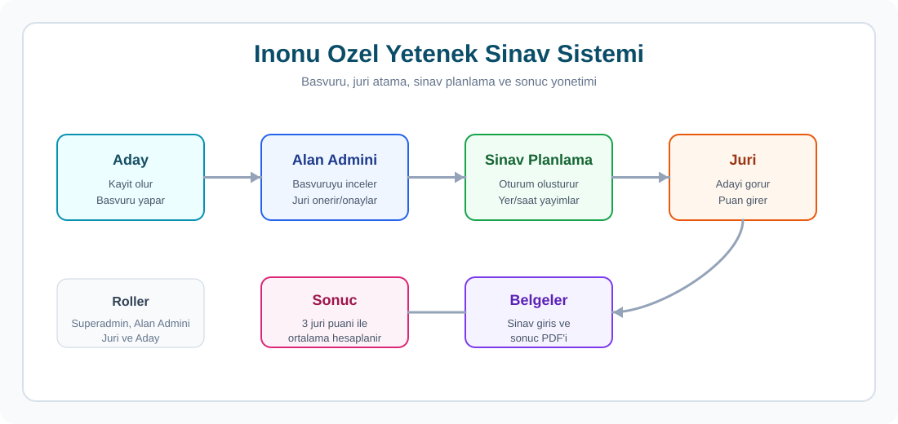
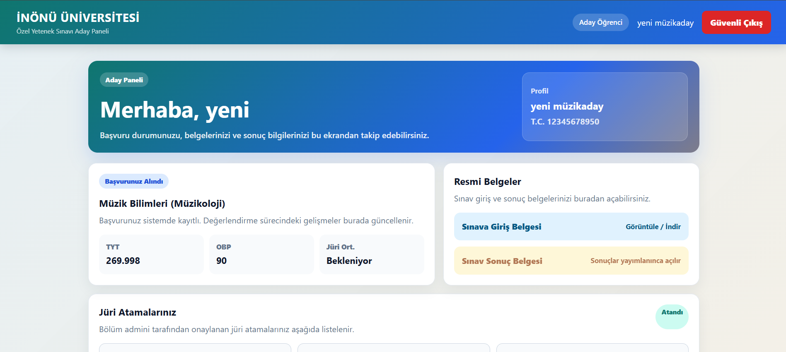
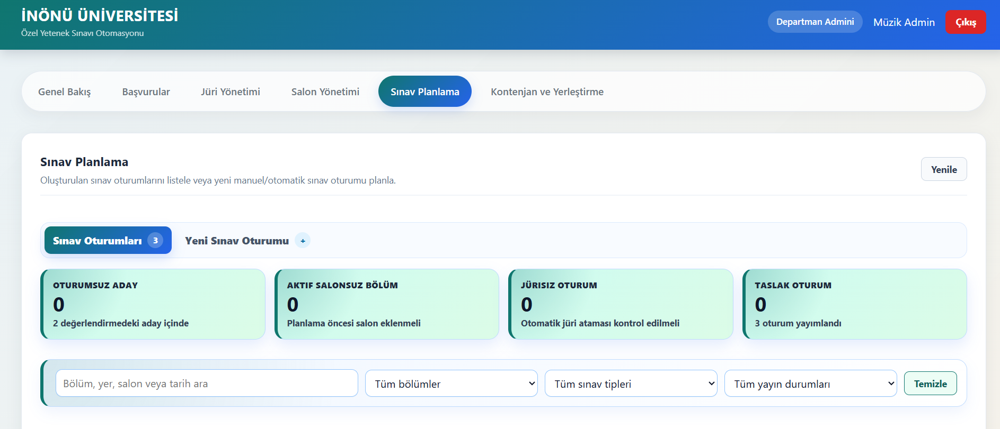
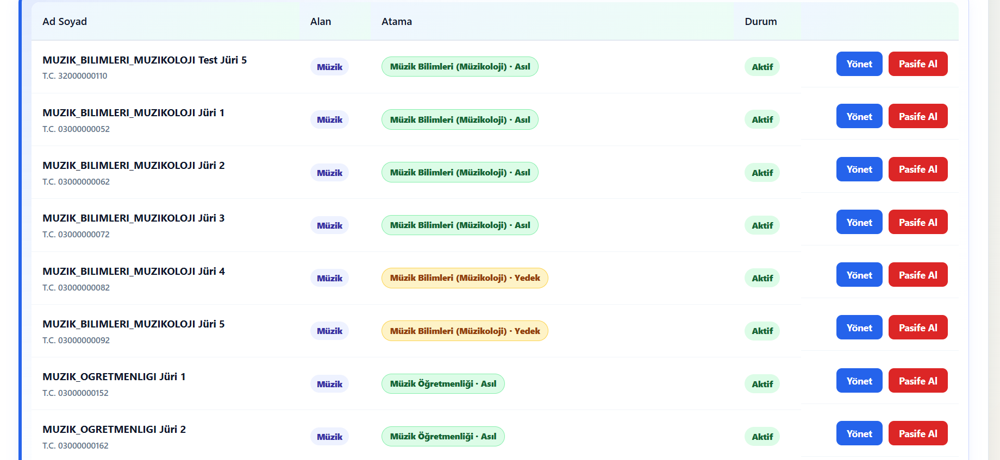
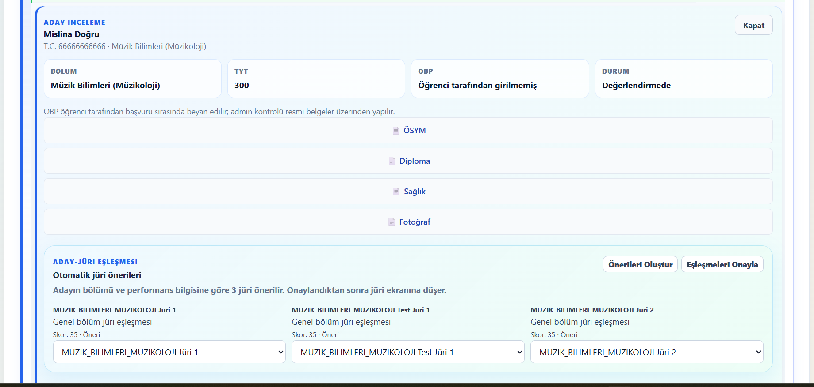
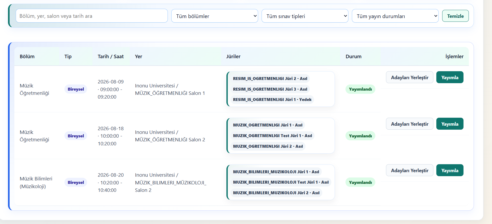
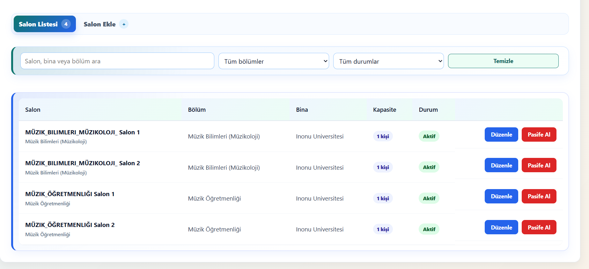

# Inonu Ozel Yetenek Sinav Sistemi


Inonu OYS, ozel yetenek sinavi basvurularini, alan bazli admin kontrollerini, aday-juri eslestirmelerini, sinav oturumlarini, juri puanlamasini ve PDF belge uretimini yoneten tam yigin bir uygulamadir.



## Ekran Goruntuleri

### Aday Ekrani



### Muzik Admin Paneli



### Juri Listesi



### Juri Oneri ve Eslesme



### Sinav Planlama



### Salon Yonetimi



## Ozellikler

- Aday kaydi ve online basvuru formu
- Muzik, spor, resim ve seramik alanlarina gore admin yetkilendirme
- Alan ve bolum uyumlu aday-juri eslestirme
- 3 onayli juri ile aday degerlendirme akisi
- Sinav oturumu olusturma, adaylari yerlestirme ve program yayimlama
- Aday panelinde sinav giris bilgileri ve PDF giris belgesi
- Juri panelinde aday bilgileri, belgeler, puanlama ve gorev ekranlari
- Superadmin icin tum alanlari kapsayan yonetim paneli
- PostgreSQL + Flyway migration yapisi

## Teknolojiler

- Frontend: Vite, React
- Backend: Spring Boot, Spring Security, JWT, Flyway
- Veritabani: PostgreSQL
- Lokal servisler: Docker Compose
- PDF / QR: OpenPDF, ZXing

## Proje Yapisi

```text
inonu-oys/
+-- docker-compose.yml
+-- inonu-oys-backend/
+-- inonu-oys-frontend/
+-- docs/
```

## Kurulum

PostgreSQL servisini baslatin:

```powershell
docker compose up -d db
```

Backend'i asagidaki ortam degiskenleriyle calistirin:

```text
DB_URL=jdbc:postgresql://localhost:15432/inonu_oys
DB_USERNAME=oys_admin
DB_PASSWORD=<local-db-password>
BOOTSTRAP_ENABLED=false
```

Frontend'i calistirin:

```powershell
cd inonu-oys-frontend
npm install
npm run dev -- --host 127.0.0.1
```

Adresler:

```text
Frontend: http://127.0.0.1:5173/
Backend:  http://localhost:8080
```

## Test Hesaplari

Test kullanici adlari yerel seed verisiyle olusturulur. Parolalar guvenlik nedeniyle README icinde tutulmaz; yerel gelistirme notlarindan veya seed ayarlarindan alinmalidir.

| Rol | Kullanici |
| --- | --- |
| Superadmin | `19769072944` |
| Muzik Admin | `20000000002` |
| Spor Admin | `20000000004` |
| Sanat Admin | `20000000006` |
| Muzik Juri 1 | `03000000152` |
| Muzik Juri 2 | `03000000162` |
| Muzik Test Juri 1 | `32000000002` |
| Ali Aday | `40000000002` |

## Uctan Uca Test Akisi

1. Yeni aday kaydi olusturun ve Muzik Ogretmenligi bolumune basvuru yapin.
2. Muzik admin ile girip basvuruyu kontrol edin.
3. Aday icin 3 muzik jurisi onerip onaylayin.
4. Sinav Planlama ekranindan Muzik Ogretmenligi icin bireysel oturum olusturun.
5. Adaylari yerlestirin ve oturumu yayimlayin.
6. Aday panelinde sinav tarihi, saati, salonu ve giris belgesini kontrol edin.
7. Atanan 3 juri ile girip aday icin puanlari girin.
8. Admin veya superadmin panelinden aday sonucunu ve ortalamayi kontrol edin.
9. Aday panelinden sinav sonuc belgesini acin.

## SIK Kullanilan Komutlar

Frontend build:

```powershell
cd inonu-oys-frontend
npm.cmd run build
```

Backend test:

```powershell
cd inonu-oys-backend
.\gradlew.bat test
```

Docker servislerini durdurma:

```powershell
docker compose down
```

## Notlar

- `uploads/`, `.run-logs/`, `node_modules/`, `dist/`, Gradle build ve cache klasorleri GitHub'a gonderilmez.
- Veritabani semasi Flyway migration dosyalariyla yonetilir.
- Lokal dosya yuklemeleri `uploads/` altinda tutulur.
